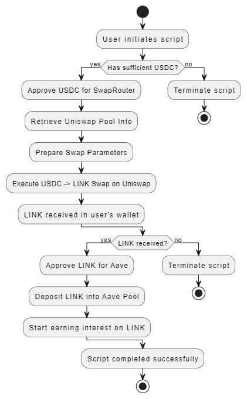

# DeFi Script: Uniswap 🤝 Aave Integration

## Overview of Script

This script demonstrates the integration of two prominent DeFi protocols, Uniswap V3 and Aave, on the Ethereum Sepolia testnet. The script is designed to perform the following operations:

1. **Token Swap on Uniswap V3**:
   - The user initiates the script to swap USDC for LINK on Uniswap.
   - The script checks the user’s USDC balance and approves the Uniswap Swap Router to spend the required amount of USDC.
   - It retrieves pool information from Uniswap, prepares the necessary parameters, and executes the swap, converting USDC to LINK.
   - The received LINK tokens are transferred to the user's wallet.

2. **Supply LINK on Aave**:
   - After successfully swapping USDC for LINK, the script approves the Aave Pool contract to spend the user's LINK.
   - The script then deposits the LINK tokens into Aave, enabling the user to earn interest on the deposited LINK.

This integration exemplifies the composability of DeFi protocols, allowing users to seamlessly transition from a token swap on Uniswap to earning yield on Aave with minimal interaction.

## Diagram Illustration

The following diagram provides a visual representation of the workflow described above. It illustrates the sequence of steps and interactions between the different protocols:



## Setup Instructions

1. Clone the project repository:
   ```bash
   git clone https://github.com/yourusername/your-repo-name.git


2. Install the necessary dependencies:
   ```bash
   npm install --save
   ```

3. Create a `.env` file in the root of the project directory and add your RPC URL and private key:
   ```bash
   RPC_URL="https://sepolia.infura.io/v3/YOUR_INFURA_PROJECT_ID"
   PRIVATE_KEY="YOUR_PRIVATE_KEY"
   ```

4. Run the script to execute the token swap and deposit the LINK tokens into Aave:
   ```bash
   node index.js
   ```

   # Code Explanation

## Overview

This document provides a detailed explanation of the code used in the DeFi script that integrates Uniswap and Aave on the Ethereum Sepolia testnet. The script is designed to perform a token swap on Uniswap and then supply the swapped tokens to Aave for earning interest. Below, we will go through the key functions, the logic behind them, and how the interactions with the DeFi protocols are handled.

## Code Structure

The script is organized into several key functions that collectively perform the following tasks:

1. **Token Approval**: Approves the necessary tokens for spending by the smart contracts.
2. **Retrieving Pool Information**: Fetches information about the Uniswap liquidity pool.
3. **Preparing and Executing the Swap**: Prepares the parameters and executes the token swap on Uniswap.
4. **Supplying Tokens to Aave**: Supplies the swapped tokens to Aave for earning interest.

## Detailed Explanation of Key Functions

### 1. `approveToken`

```javascript
async function approveToken(tokenAddress, tokenABI, amount, wallet) {
  try {
    const tokenContract = new ethers.Contract(tokenAddress, tokenABI, wallet);
    const approveAmount = ethers.parseUnits(amount.toString(), USDC.decimals);
    const approveTransaction = await tokenContract.approve.populateTransaction(
      SWAP_ROUTER_CONTRACT_ADDRESS,
      approveAmount
    );
    const transactionResponse = await wallet.sendTransaction(approveTransaction);
    console.log(`Approval Transaction Sent: ${transactionResponse.hash}`);
    const receipt = await transactionResponse.wait();
    console.log(`Approval Transaction Confirmed!`);
  } catch (error) {
    console.error("An error occurred during token approval:", error);
    throw new Error("Token approval failed");
  }
}


